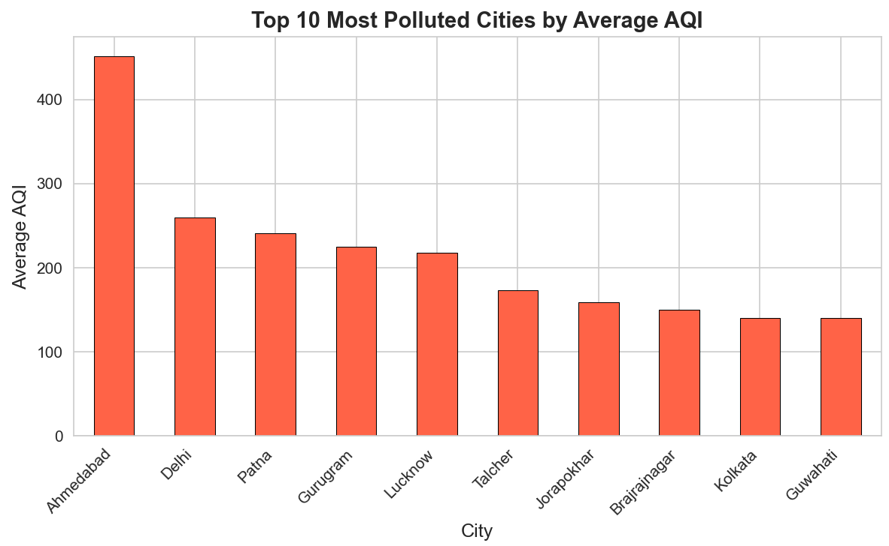
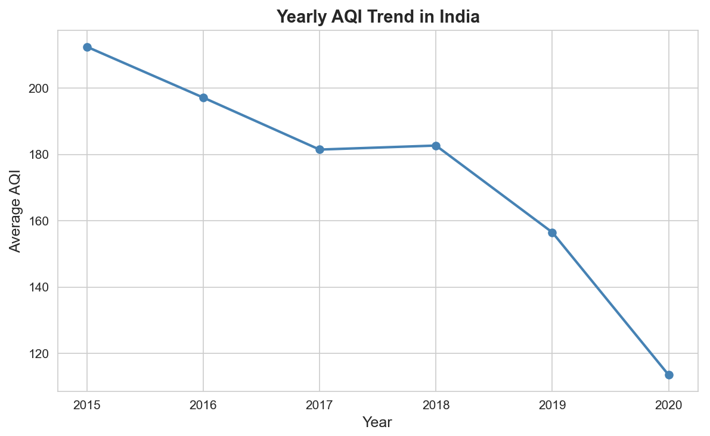
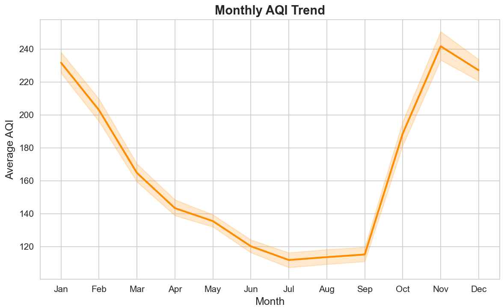
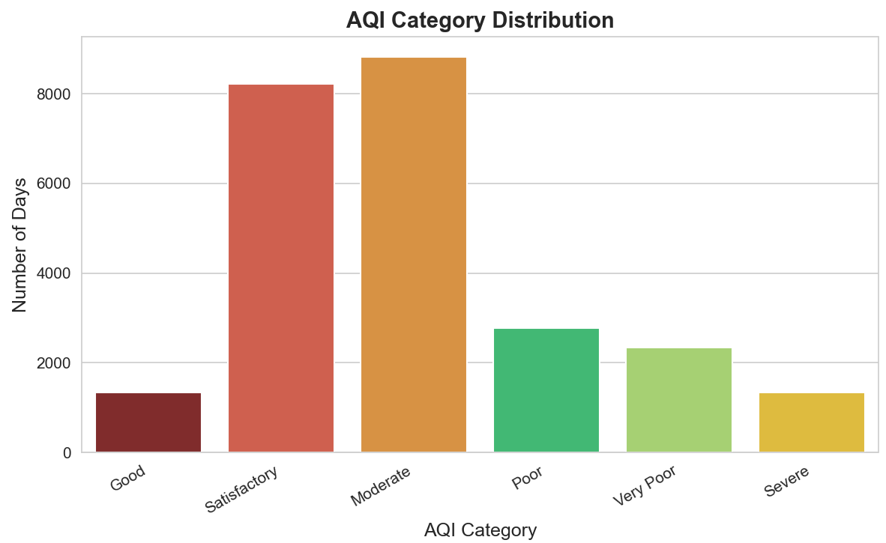
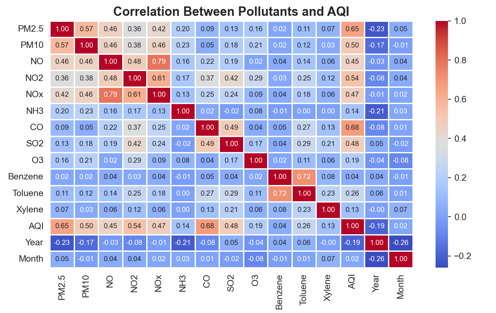
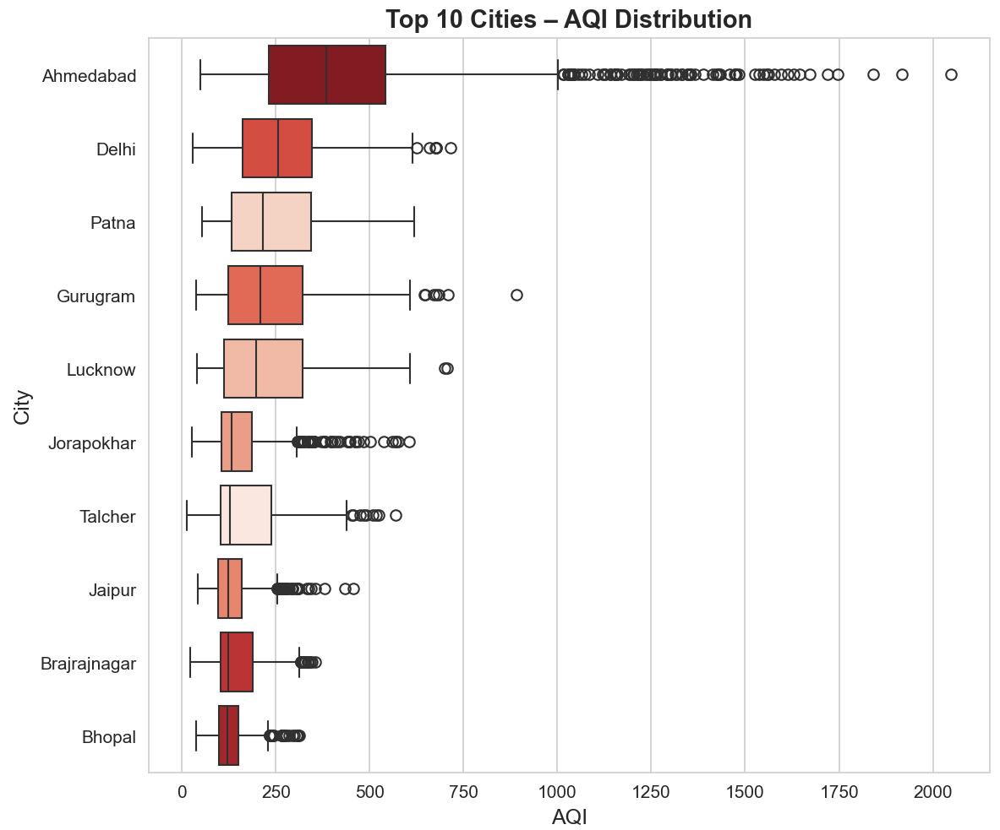
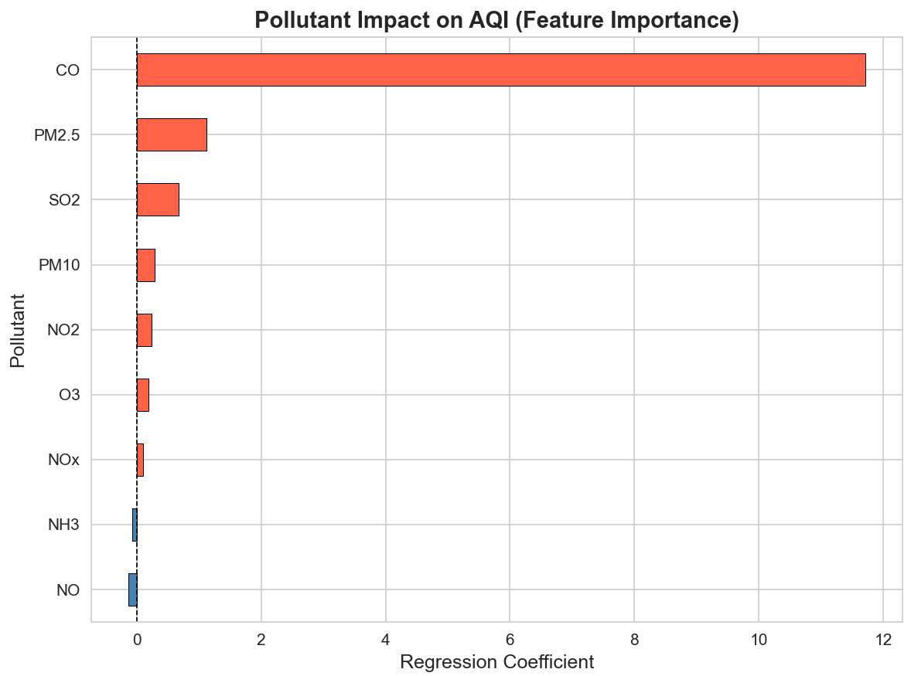
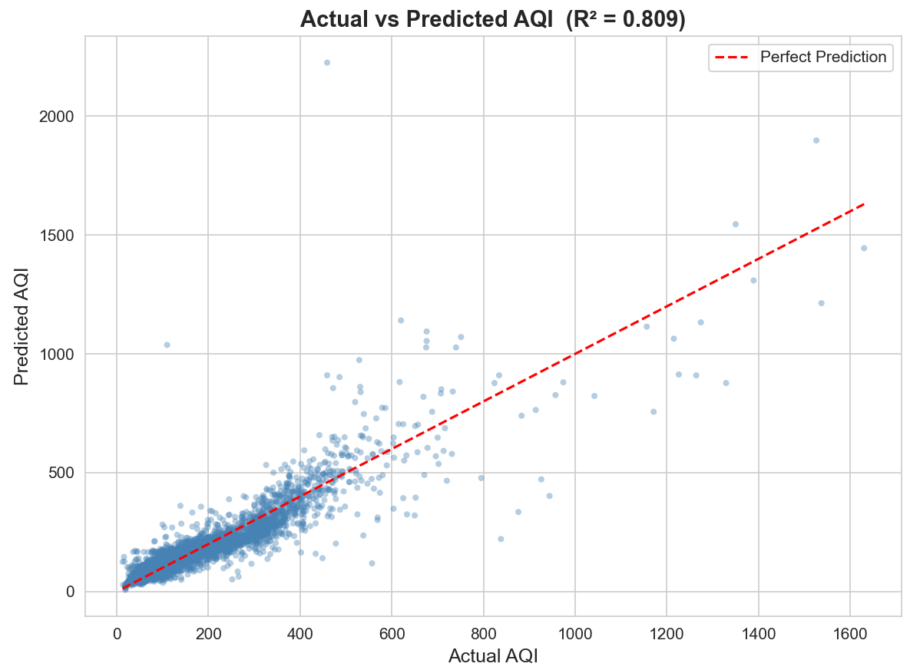

# Air-Quality-EDA-India
## Visualizations

### 1. Top 10 Most Polluted Cities

> Ahmedabad ranks highest with Avg AQI 452, followed by Delhi (259) and Patna (240).

---

### 2. Yearly AQI Trend (2015–2020)

> AQI steadily decreased from 2015 to 2020. Sharp drop in 2020 due to COVID-19 lockdowns.

---

### 3. Monthly AQI Trend

> AQI peaks in November–January (winter) and drops lowest in July (monsoon season).

---

### 4. AQI Category Distribution

> Moderate and Satisfactory are most common. Poor + Very Poor + Severe = 26% of all days.

---

### 5. Correlation Heatmap

> PM2.5 (0.65) and CO (0.68) show strongest correlation with AQI.

---

### 6. City-wise AQI Box Plot

> Ahmedabad shows extreme outliers up to AQI 2000. Delhi and Patna show consistently high spread.

---

### 7. Feature Importance (ML Model)

> CO has the highest regression coefficient (11.7), followed by PM2.5 (1.12) and SO2 (0.68).

---

### 8. Actual vs Predicted AQI

> Model R² = 0.809. Points cluster tightly along the perfect prediction line confirming strong accuracy.
